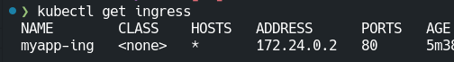

# Simple svelte app to deploy on local k8s cluster using k3d

## Create cluster

```bash
k3d cluster create --config k3d.yaml
```

Creates the cluster exposing port 8080 to port 80 of the cluster's node
so that we can acces it to localhost:8080

## Build docker image

```bash
docker build --pull -t k3d-myreg.localhost:12345/simplesvelte:latest .
```

## Push image to local cluster registry

```bash
docker push k3d-myreg.localhost:12345/simplesvelte:latest
```

## Launch app

Create the deployment, internal service (ClusterIP) and the ingress that routes
localhost:8080/ to the internal service

```bash
kubectl apply -f k8s
# Open app at localhost:8080 or directly at ingress ip.
kubectl get ingress
```


